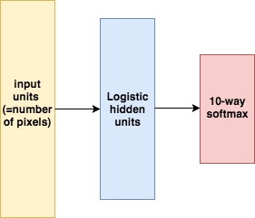
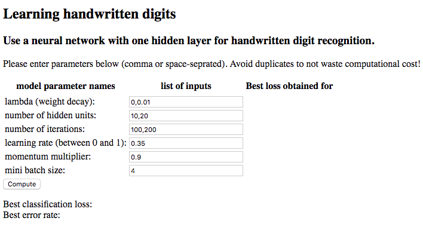
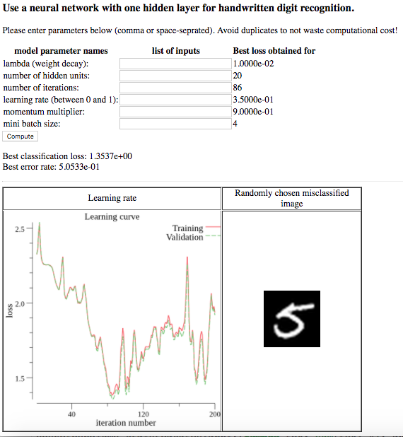

# Implementing a neural network for handwriten digits in Go

## Motivation: What does this Go project show?

This project shows how to possibly implement a neural network in Go. It especially intends to make use of the following Go specific concepts:
* Cross validation is implemented in a concurrent version using channels.
* A webserver can be started to enter hyperparameters for cross validation (based on Model View Controller architecture).
* Gonum is used to handle matrix operations for optimization.

## Problem description

The problem under consideration is the well-known MNIST data set for handwritten digits. One image is represented by a certain amount of grayscale pixels. The data set consists of images of digits ranging from 0 to 9. The model used for learning to detect the digits is a neural network with as many input units as pixels, a hidden layer with logistic activation functions, whose size can be picked by the user, and a 10-way softmax for the output. Biases are not used for simplicity. 

## Details on optimization
* The optimization, the choice of hyperparameters, and the handling of the model parameters is based on a programming assignment in MATLAB/Octave of the Coursera online course [Neural Networks for Machine Learning](https://www.coursera.org/learn/neural-networks/home/welcome) offered by Geoffrey Hinton, University of Toronto. At the time of this writing the course could be joined free of charge.
	+ optimization algorithm used: mini batch gradient descent, optionally with momentum. The momentum parameter, the size of the mini batches, and the learning rate are hyperparameters.
	+ regularization methods: L2 weight decay and early stopping. Both are hyperparameters.
	+ additional hyperparameters: number of hidden units and number of optimization iterations  
* Evaluation metric used: cross entropy error

## Where can I download the data from?

The original MNIST dataset is available from [Yann Lecun's website](http://yann.lecun.com/exdb/mnist/). These images consist of 28x28 pixels, the training set consists of 60000 images and the test set of 10000 images.

## How to use the model

1. Download data as described in the previous section. These are 4 gz compressed files (training images, training labels, test images, test labels). Store these files in the data folder.
2. Run "go get ./..." to install all dependencies.
3. Run "go build" to compile the go files.
4. Run "./gomnist" to start the webserver, which listens on :8080 by default. In case the port needs to be changed, this can be done in config.go. 
5. Locate to "localhost:8080" in the browser.
6. Enter your choice of hyperparameters and hit Compute.

7. The browser redirects to a new page. After all combinations have been calculated, the best model parameters, the validation loss, the error rate, the learning curve, and a randomly picked misclassified image are shown.

## An example of a good combination of hyperparameters

This combination is the result of some tests. It achieves a classification error rate of 0.0236 on the test set. Even better combinations are likely to exist.

lambda:              0.0000e+00
learning rate:       3.5000e-01
momentum multiplier: 9.0000e-01
number of hidden units:     110
number of iterations:      2982
mini batch size:            500
